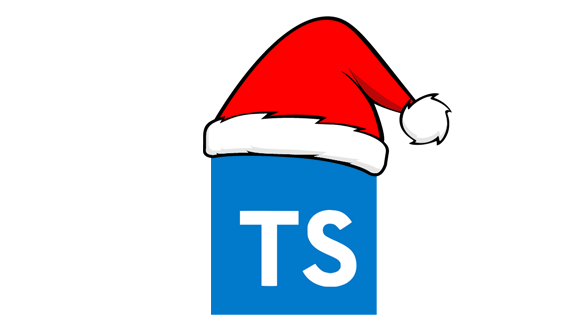

<h1 align="center">
    AdventTS Solutions [2023] 🎅🎄
</h1>

<h4 align="center">
    Repository of <a href="https://typehero.dev/aot-2023" target="_blank">Advent of TypeScript<a>, types challenges, by <a href="https://typehero.dev/" target="_blank">Typehero</a>.
</h4>

    <a href="#----summary">Summary</a> •
    <a href="#----installation">Installation</a> •
    <a href="#----challenges">Challenges</a> •
    <a href="#----license">License</a> •
    <a href="#----acknowledgments">Acknowledgments</a> •
    <a href="#----contact">Contact</a>

    

<h2>
    Summary
</h2>

    This repository serves as a housing solutions to types challenges of <a href="https://typehero.dev/aot-2023" target="_blank">Advent of TypeScript<a>. AdventTS, a project developed by <a href="https://typehero.dev/" target="_blank">Typehero</a>, offers a platform for developers to improve their type definitions skills, through a series of daily challenges spanning 25 days. The challenge begins on December 1st and culminates on December 25th.

<h2>
    Installation
</h2>
<ol>
    <li>Clone the repository</li>
    <li>Install the latest version of <a href="https://nodejs.org/es/" target="_blank">Node.js<a> and globally install <a href="https://pnpm.io/installation#using-npm" target="_blank">pnpm<a></li>
    <li>Navigate to the directory where you cloned the repository with your favorite CLI</li>
    <li>Run <code>pnpm install</code> in your CLI to install all necessary packages</li>
    <li>Finally, run <code>pnpm test</code> in your CLI to execute all challenges/tests</li>
</ol>

> **Note:** If you want to run a specific challenge/test, execute `pnpm run test:challenge<number>`.

<h2>
    Challenges
</h2>

|  #  | Challenge                                                              |        Description         |
| :-: | ---------------------------------------------------------------------- | :------------------------: |
| 01  | Create a union of any Santa favorite cookies                           | [Show](./src/01-challenge) |
| 02  | Create a union with all names of the various different cookies         | [Show](./src/02-challenge) |
| 03  | Define specific type values for Present, From, and To attributes       | [Show](./src/03-challenge) |
| 04  | Replace the values of each attributes of an object with an address     | [Show](./src/04-challenge) |
| 05  | Create an array with the values of two arrays combined                 | [Show](./src/05-challenge) |
| 06  | Exclude from first parameter all values inside the second one          | [Show](./src/06-challenge) |
| 07  | Rename keys of an object                                               | [Show](./src/07-challenge) |
| 08  | Remove attributes from an object which key names starts with "naughty" | [Show](./src/08-challenge) |
| 09  | Reverse a string                                                       | [Show](./src/09-challenge) |
| 10  | Check if a string ends with another string                             | [Show](./src/10-challenge) |
| 11  | Deep Readonly                                                          | [Show](./src/11-challenge) |
| 12  | Find index where Santa is inside an array                              | [Show](./src/12-challenge) |
| 13  | Create a union range from the first parameter to the second one        | [Show](./src/13-challenge) |
| 14  | Turn a string into a union of strings                                  | [Show](./src/14-challenge) |
| 15  | Create an array of "n" strings with a string and an union of numbers   | [Show](./src/15-challenge) |
| 16  | Find index where Santa is inside an array of arrays                    | [Show](./src/16-challenge) |
| 17  | Create a type definition to play rock paper scissors game              | [Show](./src/17-challenge) |
| 18  | Count how many toys of the specified toy are inside the toy stack      | [Show](./src/18-challenge) |

<h2>
    License
</h2>

    This repository is under <a href="./LICENSE" target="_blank">MIT License</a>, if you want to see what you are allowed to do with the content of this repository, please visit <a href="https://choosealicense.com/licenses/" target="_blank">choosealicense</a> for more information.

<h2>
    Acknowledgments
</h2>

    Thanks to <a href="https://typehero.dev/" target="_blank">Typehero</a> team to develop <a href="https://typehero.dev/aot-2023" target="_blank">Advent of TypeScript<a>.

<h2>
    Contact
</h1>

    If you want to contact me, please see my <a href="https://github.com/hozlucas28" target="_blank">socials medias</a> in my GitHub profile.

